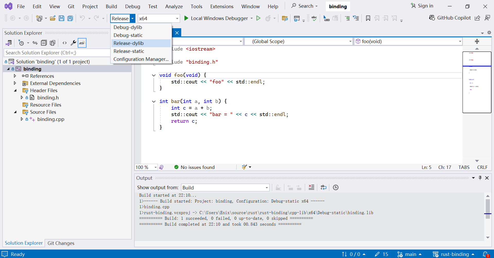

# Call windows lib/dll functions from Rust

This repo is a demo to invoke functions exposed from windows dll/lib file in rust.

I have created two functions in the cpp lib:

```cpp
void foo();

int bar(int a, int b);
```

I will demostrate how to call these two functions from rust with **static linking** and **dynamic linking**.

## 1. Build lib/dll

1.1 Open cpp-lib/binding.sln with **visual studio 2022**

1.2 select **'Release-static'** configuration


Use keyboard shortcut ctrl + shift + B to build `binding.lib` file

1.3 select **'Release-dylib'** configuration



Use keyboard shortcut ctrl + shift + B to build `binding.dll` file

## 2. Build rust_static

This package is to call the `foo` and `bar` functions with static linking.

```
cargo build -p rust_static
```

After building success, we can run the program with:

```
cargo run rust_static
```

## 3. Build rust_dylib

This package is to call the `foo` and `bar` functions with dynamic linking.

```
cargo build -p rust_dylib
```

After building success, we can't run the program directly, since the program can not find the dll:

```
cargo run rust_dylib
```

```
error: process didn't exit successfully: `target\debug\rust_dylib.exe` (exit code: 0xc0000135, STATUS_DLL_NOT_FOUND)
```

The rust program will search the dll from:

* The Directory of the Executable
* The System PATH Environment Variable
* The System Directories: C:\Windows\System32 (32-bits system) and C:\Windows\SysWOW64 (64-bits system)
* The Application’s Working Directory
* DLL Search Path, path set by `SetDllDirectory` function.

So we need to copy the binding.dll to the same dir as the `rust_dylib.exe`.

```ps
Copy-Item .\cpp-lib\x64\Release-dylib\binding.dll .\target\debug\

cargo run rust_dylib
```

Now the program should successfully run and print the following messages:

```
foo
bar = 3
res = 3
```
